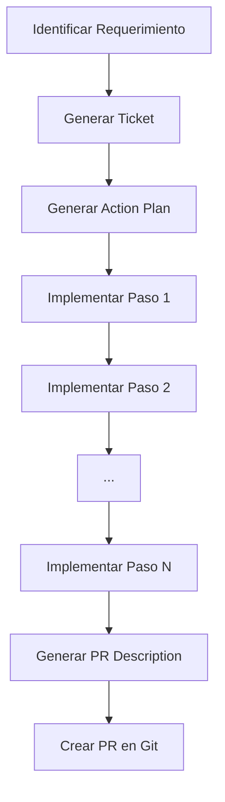

# Reglas de Cursor

Este directorio contiene reglas personalizadas para Cursor AI (archivos `.mdc`).

---

## Reglas del Stack Credo

### `project-context.mdc` (Always Apply)

Contexto esencial del stack Credo SSI: servicios (kms, storage, did, issuer, holder, verifier), stack técnico, convenciones (RemoteStorage, DIDs, Docker).

### `credo-stack-rule.mdc`

Se aplica al trabajar con archivos `.ts` en los 6 servicios. Incluye convenciones de RemoteStorageService, adaptadores Credo y Docker.

---

## Reglas adaptadas para Credo SSI

Las siguientes reglas están adaptadas para el stack Credo (TypeScript, NestJS, Credo-TS, 6 servicios, Docker):

- **`action-plan-rule.mdc`** – Planes de acción con servicios kms, storage, did, issuer, holder, verifier. Tickets CREDO-XXX.
- **`architecture-analysis-rule.mdc`** – Análisis de arquitectura para el monorepo SSI.
- **`code-cleanup-rule.mdc`** – Limpieza de código TypeScript, adaptadores Credo.
- **`code-documentation.mdc`** – JSDoc para NestJS, adaptadores, conceptos SSI.
- **`pr-description.mdc`** – Descripciones de PR para servicios del stack Credo.
- **`work-ticket.mdc`** – Tickets con formato CREDO-XXX y componentes del stack.

## Estructura

```
ai-instructions/
├── README.md                      # Este archivo
├── project-context.mdc           # Contexto esencial del proyecto (siempre activo)
├── project-context.mdc           # Contexto esencial del proyecto (siempre activo)
├── action-plan-rule.mdc          # Genera planes de acción desde tickets
├── pr-description.mdc            # Genera descripciones de PRs
├── work-ticket.mdc               # Genera tickets de trabajo
├── code-documentation.mdc         # Agrega documentación inline (siempre activo)
├── readme-rule.mdc               # Práctica de READMEs en módulos (siempre activo)
├── token-saving-rule.mdc         # Optimiza uso de tokens (siempre activo)
├── code-cleanup-rule.mdc         # Mantiene código limpio (siempre activo)
├── readme-roadmap-update-rule.mdc # Actualiza README raíz y roadmap
├── architecture-analysis-rule.mdc # Genera análisis de arquitectura
├── QUICK_REFERENCE.md            # Guía rápida de comandos
├── /tasks/                       # Planes de acción generados
├── /prs/                         # Descripciones de PRs generadas
└── /tickets/                     # Tickets de trabajo generados
```

## ¿Qué son las Reglas de Cursor?

Las reglas de Cursor (archivos `.mdc`) son instrucciones especiales que guían al asistente de IA para realizar tareas específicas de manera consistente. Son especialmente útiles para:

- Mantener estándares de código
- Documentar cambios de manera estructurada
- Planificar implementaciones complejas
- Generar documentación automáticamente

## Reglas Disponibles

### 1. `project-context.mdc` (Always Apply)

**Propósito:** Proporciona contexto esencial del proyecto al inicio de cada conversación con la IA.

**Cuándo se aplica:**
- Automáticamente al iniciar cada conversación (alwaysApply: true)
- Proporciona contexto sobre el proyecto sin necesidad de explicarlo manualmente

**Qué incluye:**
- Conceptos clave del juego (partículas, agrupaciones, núcleos, dimensiones, dioses, ECS)
- Stack técnico completo (backend, frontend, infraestructura)
- Estructura de directorios
- Convenciones del proyecto
- Estado actual del desarrollo

**Ejemplo:**
```
Al iniciar cualquier conversación, la IA automáticamente tiene contexto sobre:
- Qué es Juego de Dioses (MMO voxel-based)
- Cómo funciona el sistema de partículas
- Qué tecnologías se usan
- Dónde está cada cosa en el proyecto
```

### 2. `action-plan-rule.mdc` 

**Propósito:** Genera un plan de acción detallado paso a paso para implementar una feature o bugfix.

**Cuándo usar:**
- Al comenzar una nueva tarea/ticket
- Cuando necesitas estructurar una implementación compleja
- Para desglosar requerimientos en pasos accionables

**Cómo usar:**
1. Abre Cursor y describe el ticket o requerimiento
2. Menciona: "Necesito un action plan para [descripción del ticket]"
3. El asistente generará un archivo en `/tasks/[TICKET-ID]-action-plan_[FECHA-HORA].md` (con fecha y hora en formato `yyyy-MM-dd_HH-mm-ss`)
4. Sigue los pasos del plan uno por uno

**Ejemplo:**
```
Usuario: "Necesito un action plan para implementar sistema de recolección de partículas"
Asistente: *Genera JDG-123-action-plan_2024-12-04_14-30-45.md con pasos detallados*
```

### 3. `pr-description.mdc`

**Propósito:** Genera una descripción completa de Pull Request lista para copiar.

**Cuándo usar:**
- Después de completar la implementación
- Antes de crear el PR en Git
- Cuando quieres asegurar que la descripción del PR sea completa

**Cómo usar:**
1. Completa tu implementación y commits
2. Solicita: "Genera la descripción del PR para [TICKET-ID]"
3. El asistente generará `/prs/[TICKET-ID]_pr-description_[FECHA-HORA].md` (con fecha y hora en formato `yyyy-MM-dd_HH-mm-ss`)
4. Copia y pega el contenido en Git

**Ejemplo:**
```
Usuario: "Genera la descripción del PR para JDG-123"
Asistente: *Analiza commits y genera JDG-123_pr-description_2024-12-04_14-30-45.md*
```

### 4. `work-ticket.mdc`

**Propósito:** Genera tickets de trabajo estructurados y completos para el proyecto.

**Cuándo usar:**
- Al identificar una nueva feature o requerimiento
- Cuando se encuentra un bug que necesita ser reportado
- Para documentar mejoras o refactorizaciones necesarias
- Al planificar nuevas funcionalidades

**Cómo usar:**
1. Describe el problema, feature o mejora que necesitas
2. Solicita: "Genera un ticket para [descripción]"
3. El asistente generará `/tickets/[TICKET-ID]_work-ticket_[FECHA-HORA].md` (con fecha y hora en formato `yyyy-MM-dd_HH-mm-ss`)
4. Usa el contenido en tu sistema de gestión de proyectos (GitHub Issues, GitLab, Jira, etc.)

**Ejemplo:**
```
Usuario: "Genera un ticket para implementar sistema de recolección de partículas"
Asistente: *Genera JDG-123_work-ticket_2024-12-04_14-30-45.md con ticket completo*
```

### 5. `code-documentation.mdc` (Always Apply)

**Propósito:** Agrega automáticamente documentación Python docstring inline a código nuevo o modificado.

**Cuándo se aplica:**
- Automáticamente cuando creas o modificas código
- Se aplica a todos los cambios (alwaysApply: true)

**Qué documenta:**
- Servicios y routers FastAPI
- Modelos Pydantic
- Funciones exportadas
- Clases complejas
- Endpoints de API
- NO documenta: Imports/exports simples
- NO documenta: Variables locales
- NO documenta: Código boilerplate

**Ejemplo:**
```python
# Antes
def get_particles(dimension_id: int, viewport: dict):
    # implementación
    pass

# Después (automáticamente)
def get_particles(dimension_id: int, viewport: dict):
    """
    Obtiene partículas dentro de un viewport específico de una dimensión.
    
    Args:
        dimension_id: ID de la dimensión
        viewport: Diccionario con límites x_min, x_max, y_min, y_max, z_min, z_max
        
    Returns:
        Lista de partículas dentro del viewport
        
    Raises:
        HTTPException: Si la dimensión no existe o los parámetros son inválidos
    """
    # implementación
    pass
```

### 6. `readme-roadmap-update-rule.mdc`

**Propósito:** Mantiene actualizados el README raíz y el roadmap con referencias a todos los READMEs del proyecto y sincroniza el estado del proyecto.

**Cuándo usar:**
- Periódicamente para mantener la documentación actualizada
- Cuando se agregan nuevos READMEs al proyecto
- Cuando se completan tickets y el roadmap necesita actualización
- Para verificar que todas las referencias de documentación sean accesibles

**Cómo usar:**
1. Solicita: "Ejecuta la regla de actualización de README y roadmap" o "Actualiza la documentación"
2. La regla verificará:
   - Que el README raíz tenga referencias a todos los READMEs importantes
   - Que el roadmap esté sincronizado con el estado real del proyecto
   - Que las referencias cruzadas sean correctas
3. La regla actualizará solo lo necesario (evita gastar tokens innecesariamente)

**Qué verifica:**
- Existencia de sección "Documentación" en README raíz
- Referencias a todos los READMEs importantes del proyecto
- Sincronización entre roadmap y pending-tickets.md
- Consistencia en nombres de archivos y rutas
- Referencias rotas o incorrectas

**Estrategia de ahorro de tokens:**
- Usa `glob_file_search` y `grep` para verificar sin leer archivos completos
- Lee solo secciones necesarias con `offset/limit`
- Solo modifica archivos si hay diferencias detectadas

**Ejemplo:**
```
Usuario: "Ejecuta la regla de actualización de README y roadmap"
Asistente: *Verifica READMEs, roadmap y referencias, actualiza solo lo necesario*
```

### 7. `readme-rule.mdc` (Always Apply)

**Propósito:** Establece la práctica de mantener READMEs actualizados en cada carpeta/módulo del proyecto.

**Cuándo se aplica:**
- Automáticamente en todas las interacciones (alwaysApply: true)
- Proporciona contexto sobre la práctica de documentación establecida

**Qué establece:**
- Cada carpeta/módulo debe tener su `README.md` que explique qué contiene y cómo usarlo
- Contenido mínimo: título, estructura, componentes principales, ejemplos de uso, referencias
- Estilo profesional sin emojis
- Actualizar READMEs cuando se crean/modifican módulos

**Ejemplo:**
```
Al crear un nuevo módulo, la IA automáticamente sabe que debe:
- Crear un README.md en la carpeta del módulo
- Incluir estructura, componentes y ejemplos
- Referenciar READMEs hijos
- Mantener estilo profesional
```

### 8. `token-saving-rule.mdc` (Always Apply)

**Propósito:** Optimiza el uso de tokens evitando búsquedas extensas y generación de archivos innecesarios.

**Cuándo se aplica:**
- Automáticamente en todas las interacciones (alwaysApply: true)
- Prioriza ahorro de tokens sobre completitud cuando no se requiere archivo

**Qué hace:**
- Respuestas concisas cuando no se requiere generar archivos
- Evita búsquedas extensas en preguntas simples o conversacionales
- Solo hace búsquedas profundas cuando se necesita generar información para almacenar
- No genera archivos a menos que se solicite explícitamente

**Ejemplo:**
```
Usuario: "¿Cómo funciona el sistema de partículas?"
Respuesta CORRECTA (ahorra tokens): Respuesta concisa sin búsquedas extensas

Usuario: "Genera un plan de acción para implementar sistema de combate"
Respuesta CORRECTA (cuando se necesita): Activa regla correspondiente, hace búsquedas necesarias
```

### 9. `code-cleanup-rule.mdc` (Always Apply)

**Propósito:** Mantiene el código limpio, sin redundancias y elimina archivos temporales obsoletos.

**Cuándo se aplica:**
- Automáticamente cuando se crea o modifica un archivo (alwaysApply: true)
- Revisa redundancias y archivos obsoletos

**Qué revisa:**
- Funciones duplicadas que pueden consolidarse
- Lógica repetida que puede extraerse
- Imports no utilizados
- Código comentado obsoleto
- Archivos temporales que ya no se usan
- Scripts de prueba obsoletos

**Ejemplo:**
```
Al crear o modificar código, la IA automáticamente:
- Verifica si hay funciones similares que puedan reutilizarse
- Identifica imports no usados
- Sugiere consolidar lógica duplicada
- Propone eliminar archivos temporales obsoletos
```

### 10. `architecture-analysis-rule.mdc`

**Propósito:** Genera análisis de arquitectura detallados y estructurados evaluando la situación actual y proponiendo mejoras arquitectónicas escalables.

**Cuándo usar:**
- Al evaluar o mejorar la arquitectura del proyecto
- Cuando se necesita preparar el proyecto para escalar
- Para identificar problemas arquitectónicos y proponer soluciones
- Antes de grandes refactorizaciones

**Cómo usar:**
1. Solicita: "Genera un análisis de arquitectura para [descripción del problema/necesidad]"
2. Proporciona contexto relevante y ticket ID si existe
3. El asistente generará `/analysis/[TICKET-ID]-architecture-analysis_[FECHA-HORA].md`
4. Usa el análisis como base para generar tickets y planes de acción

**Qué incluye el análisis:**
- Situación actual (backend, frontend, base de datos)
- Problemas identificados y limitaciones
- Necesidades futuras y requisitos de escalabilidad
- Arquitectura propuesta con estructura y patrones
- Plan de migración por fases
- Consideraciones técnicas y ejemplos

**Ejemplo:**
```
Usuario: "Genera un análisis de arquitectura para preparar el proyecto para agregar plantas, animales y razas"
Asistente: *Genera JDG-005-architecture-analysis_2024-12-04_14-30-45.md con análisis completo*
```

## Flujo de Trabajo Recomendado

### Para Features Nuevas



**Paso a paso:**

1. **Crear Ticket (Opcional pero recomendado)**
   ```
   "Genera un ticket para [descripción de la feature]"
   ```

2. **Planificación**
   ```
   "Necesito un action plan para [TICKET-ID]: [descripción]"
   ```

2. **Implementación Incremental**
   ```
   "Implementa el Paso 1 del action plan"
   "Implementa el Paso 2 del action plan"
   ...
   ```

3. **Documentación Automática**
   - Se aplica automáticamente mientras codificas
   - No requiere acción manual

4. **Generar PR**
   ```
   "Genera la descripción del PR para [TICKET-ID]"
   ```

5. **Crear PR en Git**
   - Copia el contenido de `/prs/[TICKET-ID]_pr-description_[FECHA-HORA].md` (busca el archivo más reciente)
   - Pégalo en la descripción del PR

### Para Bugfixes

Para bugs menores puedes omitir el action plan y ir directo a la implementación:

```
"Fix el bug [descripción]"
// Implementación
"Genera la descripción del PR para [TICKET-ID]"
```

## Convenciones de Juego de Dioses

### Conventional Commits
- `feat(scope):` - Nueva funcionalidad
- `fix(scope):` - Corrección de bug
- `docs:` - Cambios en documentación
- `refactor(scope):` - Refactorización
- `chore:` - Tareas de mantenimiento
- `test:` - Agregar/modificar tests

**Scopes comunes:**
- `particles`, `dimensions`, `agrupaciones`
- `frontend`, `backend`
- `database`, `api`, `websocket`

### Tecnologías Stack
- **Backend:** Python 3.11, FastAPI, Uvicorn, asyncpg
- **Frontend:** HTML5, JavaScript (ES6+), Three.js
- **Base de datos:** PostgreSQL 16
- **Cache:** Redis 7
- **Cálculos:** NumPy, SciPy
- **Grafos:** NetworkX (para conectividad de núcleos)
- **Containerización:** Docker + Docker Compose
- **Servidor Web:** nginx (para frontend)

### Nomenclatura de Archivos Generados

Todos los archivos generados por las reglas incluyen fecha y hora en su nombre para facilitar el seguimiento y evitar conflictos:

**Formato de fecha/hora:** `yyyy-MM-dd_HH-mm-ss` (ejemplo: `2024-12-04_14-30-45`)

**Archivos afectados:**
- **Tickets:** `[TICKET-ID]_work-ticket_[FECHA-HORA].md`
  - Ejemplo: `JDG-001_work-ticket_2024-12-04_14-30-45.md`
- **Action Plans:** `[TICKET-ID]-action-plan_[FECHA-HORA].md`
  - Ejemplo: `JDG-001-action-plan_2024-12-04_14-30-45.md`
- **PR Descriptions:** `[TICKET-ID]_pr-description_[FECHA-HORA].md`
  - Ejemplo: `JDG-001_pr-description_2024-12-04_14-30-45.md`

**Nota:** La IA ejecutará automáticamente `Get-Date -Format "yyyy-MM-dd_HH-mm-ss"` para obtener la fecha y hora actual antes de crear cada archivo. Si necesitas encontrar un archivo específico, busca por el TICKET-ID y ordena por fecha de creación.

## Tips y Mejores Prácticas

### 1. Usa Action Plans para Tareas Complejas
Si una tarea involucra más de 3 pasos o múltiples archivos, genera un action plan primero.

### 2. Implementación Incremental
Sigue los pasos del action plan uno a la vez. No intentes implementar todo de una vez.

### 3. Commits Frecuentes
Haz commits después de cada paso significativo con mensajes descriptivos.

### 4. Revisa la Documentación Generada
Aunque la documentación se genera automáticamente, revísala para asegurar que sea precisa.

### 5. Actualiza el Action Plan
Marca los pasos como completados a medida que avanzas.

### 6. Personaliza la PR Description
Aunque la descripción del PR se genera automáticamente, puedes agregar contexto adicional si es necesario.

## Configuración en Cursor

### Activar Reglas Manualmente

Si una regla no se activa automáticamente:

1. Abre la paleta de comandos (Ctrl/Cmd + Shift + P)
2. Busca "Cursor: Apply Rule"
3. Selecciona la regla que deseas aplicar

### Verificar Reglas Activas

Las reglas con `alwaysApply: true` se activan automáticamente:
- `project-context.mdc`
- `code-documentation.mdc`
- `readme-rule.mdc`
- `token-saving-rule.mdc`
- `code-cleanup-rule.mdc`

Las reglas con `alwaysApply: false` deben invocarse manualmente:
- `action-plan-rule.mdc`
- `pr-description.mdc`
- `work-ticket.mdc`
- `readme-roadmap-update-rule.mdc`
- `architecture-analysis-rule.mdc`

## Ejemplos Reales

### Ejemplo 1: Implementar Sistema de Recolección de Partículas

```
# 1. Crear Ticket (opcional pero recomendado)
"Genera un ticket para implementar sistema de recolección de partículas"

# 2. Planificación
"Necesito un action plan para JDG-456: Implementar sistema de recolección de partículas"

# 3. Implementación
"Implementa el Paso 1: Crear endpoint POST /api/v1/particles/{id}/collect"
"Implementa el Paso 2: Actualizar estado de partícula a extraida"
"Implementa el Paso 3: Agregar partícula al inventario del jugador"
...

# 4. Generar PR
"Genera la descripción del PR para JDG-456"

# 5. Resultado
- /tickets/JDG-456_work-ticket_2024-12-04_14-30-45.md
- /tasks/JDG-456-action-plan_2024-12-04_14-30-45.md
- /prs/JDG-456_pr-description_2024-12-04_14-30-45.md
- Código documentado automáticamente
```

### Ejemplo 2: Fix Bug de Conectividad de Núcleos

```
# Sin action plan (bug simple)
"Fix el bug JDG-789: Núcleos de seres vivos no se verifican correctamente"

# Después de implementar
"Genera la descripción del PR para JDG-789"

# Resultado
- /prs/JDG-789_pr-description_2024-12-04_14-30-45.md
- Código documentado
```

## Contribuir

Si necesitas agregar nuevas reglas o mejorar las existentes:

1. Crea un archivo `.mdc` en este directorio
2. Define el `description` y `alwaysApply`
3. Documenta el propósito y uso en este README
4. Prueba la regla con casos reales
5. Comparte con el equipo

## Notas

- Los archivos generados en `/tasks/` y `/prs/` deben versionarse en Git
- Sirven como documentación histórica del proyecto
- Ayudan a nuevos desarrolladores a entender decisiones de implementación

## Referencias

- [Cursor Documentation](https://docs.cursor.sh/)
- [Conventional Commits](https://www.conventionalcommits.org/)
- [FastAPI Documentation](https://fastapi.tiangolo.com/)
- [Three.js Documentation](https://threejs.org/)
- [PostgreSQL Documentation](https://www.postgresql.org/docs/)

---

**Última actualización:** Diciembre 2024  
**Mantenido por:** Equipo de Desarrollo Juego de Dioses

